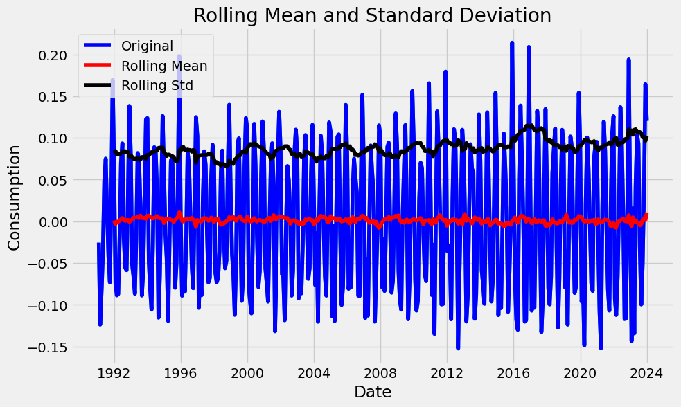

# Electricity Production Forecasting

Time-series analysis and forecasting of monthly electric & gas utility production,
using classical statistical methods — stationarity testing, seasonal decomposition,
and ARIMA / exponential smoothing.


---

## The problem

Utility production is strongly seasonal — demand swings with heating and cooling
cycles — which makes naive trend-fitting a poor forecaster. The interesting question
isn't "can we draw a line through this", it's whether the series can be made
**stationary** enough for an ARIMA model to be valid at all, and what the seasonal
component looks like once you strip the trend out.

## Dataset

`Electric_Production.csv` — a monthly index of US industrial production for electric
and gas utilities (FRED series `IPG2211A2N`).

| | |
|---|---|
| **Frequency** | Monthly |
| **Coverage** | January 1991 → January 2024 |
| **Observations** | 397 |
| **Columns** | `DATE`, `Value` (production index) |

## Approach

1. **Exploratory analysis** — plot the raw series, identify trend and seasonal swing.
2. **Seasonal decomposition** (`seasonal_decompose`) — split the series into
   trend, seasonal, and residual components to see what each contributes.
3. **Stationarity testing** — Augmented Dickey-Fuller (ADF) test, then differencing
   until the series is stationary. This determines the `d` term for ARIMA.
4. **ACF / PACF inspection** — read off candidate `p` and `q` orders from the
   autocorrelation and partial autocorrelation plots.
5. **Modelling** — fit and compare:
   - **ARIMA** — on the differenced, stationary series
   - **Simple Exponential Smoothing**
   - **Holt-Winters Exponential Smoothing** — captures trend + seasonality directly
6. **Evaluation** — forecasts scored with **RMSE** and **MAPE**.

> A note on metrics: this is a regression/forecasting problem, so RMSE and MAPE are
> reported rather than "accuracy" — accuracy is a classification metric and doesn't
> apply to a continuous series.

## Tech stack

| Purpose | Library |
|---|---|
| Data handling | pandas, numpy |
| Statistical modelling | statsmodels (`ARIMA`, `ExponentialSmoothing`, `seasonal_decompose`, `adfuller`, `acf`/`pacf`) |
| Visualisation | matplotlib |

## Running it

This project is a single self-contained notebook.

```bash
git clone https://github.com/sahil7359/electricity_consumption_forecasting.git
```

```bash
cd electricity_consumption_forecasting && pip install -r requirements.txt
```

```bash
jupyter notebook project.ipynb
```

Run the cells top to bottom — the dataset is committed alongside the notebook, so
there is nothing else to download.

## What's in here

| File | Contents |
|---|---|
| `project.ipynb` | Full analysis — EDA, decomposition, ADF testing, model fitting, evaluation |
| `Electric_Production.csv` | The dataset (397 monthly observations) |
| `report.pdf` | Written report of the findings |
| `ss/` | Plots and figures generated during the analysis |

## Results

### Achieving stationarity

ARIMA assumes a stationary series — constant mean and variance over time. The raw
production index is neither: it trends upward and swings seasonally. After
transformation and differencing, both conditions hold:



The **rolling mean sits flat at zero** across three decades and the **rolling standard
deviation stays within a narrow band** — the visual confirmation that pairs with the
ADF test result. The dense blue oscillation is the seasonal signal, which is exactly
what should remain once trend is removed.

Full plots — decomposition, ACF/PACF, and forecast overlays — are in [`ss/`](ss/), and
the written analysis is in [`report.pdf`](report.pdf).

## What I'd do differently now

Honest notes, since this was an earlier project:

- **Hold out a proper test set.** Forecast quality should be judged on a chronological
  split, never a random one — random splits leak future information into training.
- **Use SARIMA over ARIMA.** The series is visibly seasonal; a seasonal ARIMA models
  that directly instead of relying on differencing to remove it.
- **Add a baseline.** A seasonal-naive forecast (this month = same month last year)
  is the bar any real model has to clear, and it's often surprisingly hard to beat.
- **Package the code.** Extracting the notebook into modules with a `requirements.txt`
  would make results reproducible rather than depending on ambient library versions.

## License

Not currently licensed. Available for reference and learning.
